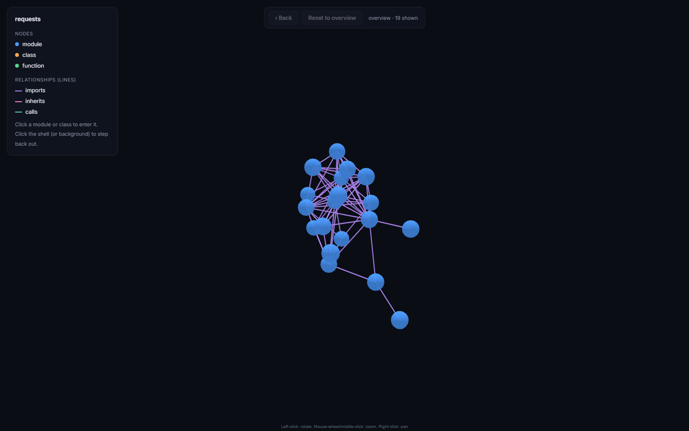
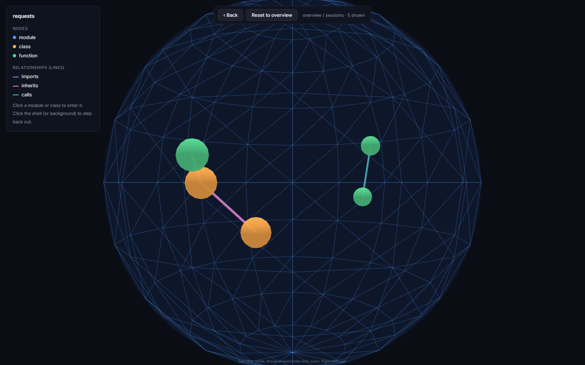

# Codebase Knowledge Graph

## What this is

An agent that explores a real, unfamiliar codebase and builds a live, explorable knowledge graph of it. You can click through the graph as it forms: nodes are the files, functions, and classes in the repo, and edges capture how they actually relate to each other, through imports, function calls, and class inheritance recovered by static analysis, plus semantic similarity from embeddings. Claude Code can also query the graph directly through an MCP server instead of reading and grepping through files, and the graph itself renders as a 3D scene you can navigate to build a mental map of the codebase.

**[Try the live 3D graph](https://tarek-yagami.github.io/codebase-knowledge-graph/demo.html)**, no install, click straight into it. It's the `requests` library, pre-built and hosted as a static page, the same output `codegraph-viz` would generate for any Python codebase you point it at.

**Want to just use it?** Skip straight to the **[usage guide](docs/USAGE.md)** for install options, connecting it to Claude Code, and a full tool reference. Everything below this point is the research story: what was tested, what held up, and what didn't.

  
  

<em>Left: the module-level overview of <code>requests</code>. Right: stepped inside the <code>sessions</code> module, its classes and functions floating inside their own self-contained shell.</em>

## The real problem

Understanding an unfamiliar codebase is slow, and it's something almost every developer has felt firsthand. A knowledge graph makes that structure visible and walkable instead of hidden inside files you have to read one at a time. Whether making the structure explicit, real nodes, real edges, actually produces better answers than a good semantic search over the same code was treated as a real, open question here rather than assumed, and testing it honestly turned out to be as much a part of this project as building the graph itself.

## The honest bottom line

Two different things got tested, and they came back with different answers.

Does the graph make Claude Code's answers *better*? No, not in any way this project could detect, even after deliberately designing questions to stress it. Does the graph make Claude Code *cheaper*? Yes, modestly and inconsistently, but really. Full evidence for both is below.

So the value this project actually delivers is narrower than the original pitch, structured retrieval doesn't seem to produce smarter answers, at least not for an agent already capable of iterating on its own. What holds up is a real, if uneven, cost saving when Claude Code has structural access instead of grepping cold, plus something no flat-chunk system can offer at all regardless of how good its retrieval is: an actual, explorable 3D map of how a codebase fits together. That's a different kind of value, spatial orientation rather than answer accuracy, and it's not something the quality comparison below was ever positioned to capture either way.

## Research questions

1. Does structural graph traversal plus semantic retrieval answer real "how does X relate to Y" questions about a codebase better than plain flat-chunk RAG over the same code? **Tested: no.**
2. How much of a codebase's real structure can static analysis recover automatically, and where does it break down, say with dynamic dispatch, reflection, or metaprogramming? **Tested: yes, three real limits found.**
3. Can the exploration stay visible and still be fast enough to hold up in a demo on a real, non-trivial repo? **Tested: yes, with real numbers below.**
4. How much cheaper is answering a real codebase question through the pre-built graph compared to a general coding agent that explores the repo from scratch with only file tools, at the same answer quality? **Tested: yes, modestly.**

## What the token-economy experiment found (research question 4)

The same real questions were run twice through Claude Code, once with only its default file tools and once with the codegraph MCP server also available, first against `requests` (21 files) and then against Django's core package (846 files), to see whether a pre-built graph actually saves tokens over exploring a codebase cold, and whether that gap grows with codebase size the way the theory predicts.

It does. On `requests`, the graph condition used about 5% fewer tokens overall, a real but modest edge. On Django, that grew to about 14% fewer tokens overall, and the clearest single result in the whole experiment was "how many classes define `save()` and how do they relate": the graph answered it in 16 turns and 22% fewer tokens, where the file-reading baseline needed 26 turns to track down the same set of methods by hand.

The experiment also caught a real bug in the tool along the way. Common-word searches (`close()`, `clean()`) sometimes backfired, since `search_nodes` matched against docstrings as well as names, and a docstring casually mentioning "clean" has nothing to do with a method actually named `clean`. Splitting that into a precise `find_by_name` lookup plus a ranked, clearly-labeled fuzzy search fixed the worst case outright, the `close()` question went from a loss against baseline to using less than half the tokens it needed before.

One more honest finding: total dollar cost barely moved between conditions in either experiment, because it's dominated by a fixed per-call cost of loading the system prompt and tool definitions, not by how much exploring happened. Token count, not cost, is the metric that actually reflects what's being tested here.

## What the graph-vs-flat-RAG experiment found (research question 1)

This one compared answer quality directly: Claude Code with only a structural graph tool against Claude Code with only a flat semantic-search tool built from the exact same embeddings, no relationships, no structure, just isolated code chunks ranked by meaning. Both conditions were deliberately denied Read/Grep/Glob, so neither could fall back to just reading files.

On straightforward relationship questions (does this class inherit from that one, what does this method call), both conditions gave equally correct answers. The real test was two questions designed to stress recall: "list every class that defines a `save()` method" (21 real ones in Django) and "list every place `clean()` is defined" (28 real ones). Flat-chunk retrieval has no guaranteed way to surface a complete list like that, top-k similarity search could plausibly miss some. It didn't. Every line number both conditions cited was cross-checked against the real Django source directly, and both answers referenced the exact same complete set, 21 out of 21, 28 out of 28, every time.

Turn counts told an inconsistent story rather than a clean one. On `clean()`, the graph needed 5 turns against flat-RAG's 18. On `save()`, the graph needed 24 against flat-RAG's 21, flat-RAG was faster there. And on the one concrete factual error found in either experiment, the graph condition was the one that got it wrong: it labeled line 1399 of `forms/models.py` as `ModelChoiceField.clean`, when the real class at that line is `InlineForeignKeyField`. Flat-RAG named it correctly. The graph also undercounted its own complete, correct list as "27 definitions" when it had actually listed all 28, a self-counting slip rather than a missing item, but still an error the flat-chunk answer didn't make.

The likely explanation is that this comparison wasn't as clean a test of structure's value as it looked. Both conditions are driven by the same capable, iterative Claude Code agent, which can just call its tool again with different phrasing to compensate for weaker retrieval. A true single-shot RAG benchmark, retrieve once, answer from that alone, no iteration, would likely show a real gap. What got tested here is closer to "does an agentic assistant benefit from a graph tool versus a flat-chunk tool", both agentic, both able to iterate. Under that framing, near-parity is a legitimate result rather than a flaw in the test.

## Where static analysis breaks down (research question 2)

Three real limits showed up during actual use, not hypothetical ones.

Name collisions are the biggest one. A call like `self.request()` only means one specific thing at runtime, but nothing in the source text says which one without knowing the type of `self`. Early on, this resolved to whichever function happened to be named `request` first in parse order, which was simply wrong more often than it was right. The fix was to stop guessing: `self.x()` now resolves against the enclosing class and its base classes specifically, and a bare `x()` only resolves if the name is unambiguous across the whole codebase. Everything else is left honestly unresolved. That's a real, permanent ceiling on what static analysis alone can determine, not a bug still waiting to be fixed.

Typing overloads are a smaller, cleaner case. A method written as two or three `@overload` stub signatures followed by the real implementation is, to a naive AST walk, three separate functions sharing one name, which produced literal duplicate edges in the graph. The fix was to recognize and skip overload stubs entirely, since they're compile-time-only and carry no real behavior of their own.

The hardest case can't be fixed at all, only acknowledged. Django defines `class Manager(BaseManager.from_queryset(QuerySet)):`, a base class that's the *return value of a function call*, not a name. Knowing what that resolves to requires actually running `from_queryset(QuerySet)`, which is exactly the kind of dynamic behavior static analysis is fundamentally unable to see. This is the honest edge of what parsing source text can ever tell you, no amount of cleverness in the parser closes that gap, only executing the code would.

## How fast this stays at scale (research question 3)

Parsing Django's core package (846 files, about 12,000 nodes) takes single-digit seconds once the OS has the files cached, and up to around 12 seconds cold. Semantic embeddings for all ~11,000 functions and classes take about 2 minutes the very first time, then get cached to disk and load in well under a second after that.

What isn't cached yet, and honestly should be: the semantic similarity edges get recomputed from the cached embeddings on every single server startup, which took about 4-5 seconds in testing on Django's scale. Combined with parsing and import overhead, a fresh MCP server launch against Django lands somewhere in the 10-25 second range depending on how warm the filesystem cache is. That's fine for a single demo session, since the server stays running once started, but it's real, measured latency, not an assumption, and caching the similarity edges alongside the embeddings would be the obvious next fix if this needed to feel instant on every single launch.

## Status

The static analysis pipeline, the [3D graph viewer](https://tarek-yagami.github.io/codebase-knowledge-graph/demo.html), the MCP server, the semantic embedding layer, and both experiments above are built, tested against real codebases, and reported honestly, including where the results didn't confirm the original hypothesis. There's an automated test suite (`pytest`, 27 tests), `ruff` and `mypy` both clean, CI running all of that plus a Docker build check on every push, and a proper installable package with console scripts.

## Try it yourself

See the **[usage guide](docs/USAGE.md)** for the quickstart, install options (pip, source checkout, Docker), connecting it to Claude Code, a tool reference, troubleshooting, and how to reproduce the research above.

## Out of scope for now

Python only, rather than trying to parse multiple languages from the start. Static analysis has real limits around dynamic dispatch and reflection, and those limits are being accepted rather than solved. The goal is a strong local demo, not a hosted multi-user product, so there's no deployment work planned. The graph doesn't need a full incremental-update engine either, that's a nice-to-have rather than something the project depends on. And there's no fine-tuning anywhere in this.
