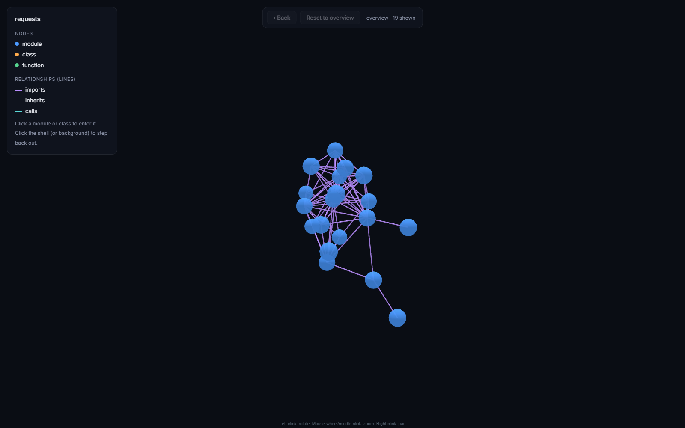
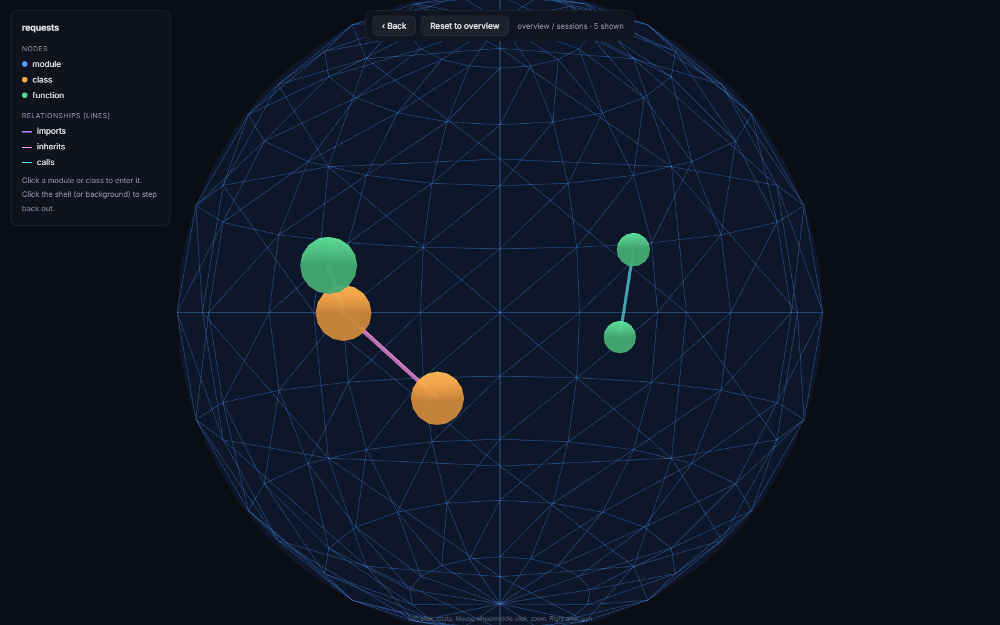

# Codebase Knowledge Graph

Your codebase as a world you can fly into. Any repo becomes an explorable 3D knowledge graph, and Claude Code gets the same map through MCP to answer questions without reading every file.

[](https://tarek-yagami.github.io/codebase-knowledge-graph/)
[](https://github.com/Tarek-yagami/codebase-knowledge-graph/actions/workflows/tests.yml)
[](LICENSE)


<p align="center">
  
  
</p>

This tool reads a repository the way a compiler's front end does, and keeps what it learns. Every file, class and function becomes a node, and every import, call and inheritance becomes an edge you can check against the source. That graph gets used in two ways.

## Walk around it in 3D

Modules float in space like planets. Click one to fly inside and see its classes and functions orbiting in their own shell, then click the empty space to fly back out. Lines are colored by kind, so imports, calls and inheritance never blur together. The [live demo](https://tarek-yagami.github.io/codebase-knowledge-graph/) is the `requests` library, ready to explore in your browser with nothing to install.

## Let Claude Code use it

Without it, Claude Code answers structural questions by grepping and opening files until the picture comes together. With the graph as an MCP server, those questions become a single lookup. Here's what it gives back on the `requests` library:

| Ask Claude Code | It looks up | What comes back on `requests` |
|---|---|---|
| What calls `api.request`? | `get_relationships` | `get`, `options`, `head`, `post`, `put`, `patch` and `delete`, the seven verb helpers |
| Which classes define `close()`? | `find_by_name` | `BaseAdapter`, `HTTPAdapter`, `Response` and `Session` |
| What could break if I change `cookies.py`? | `impact_of_changes`, or `/codegraph:impact` | 30 functions and classes spread across 10 other files |
| Where should I start reading? | `suggested_reading_order`, or `/codegraph:tour` | The modules in order, starting from `__version__.py` and `compat.py`, which everything else builds on |
| Where's the code that retries failed requests? | `semantic_search` (optional extra) | Matches by meaning, even when nothing is named "retry" |

## Quick start

You need [uv](https://docs.astral.sh/uv/getting-started/installation/) installed. Then, inside Claude Code:

```
/plugin marketplace add Tarek-yagami/codebase-knowledge-graph
/plugin install codegraph@codebase-knowledge-graph
```

Restart Claude Code and that's it. Claude Code now reaches for the graph on its own whenever a question is about how code connects, like "what calls this function?" or "what does this module depend on?". The plugin also adds three commands:

| Command | What it does |
|---|---|
| `/codegraph:map` | Opens the current project as a 3D graph in your browser |
| `/codegraph:impact` | Shows everything that depends on your uncommitted changes |
| `/codegraph:tour` | Walks you through the codebase in the order its parts build on each other |

The first run takes a minute while `uv` fetches the package. After that the server starts in seconds, even on a large repo.

**Without Claude Code**, install the package and point it at any repo:

```bash
pip install git+https://github.com/Tarek-yagami/codebase-knowledge-graph.git
codegraph-viz /path/to/your/project
```

It opens the graph in your browser. Click a module to step inside it, and click the empty space around it to step back out. Semantic search is an optional extra because it pulls in PyTorch, so add `[semantic]` to the install if you want it. The [usage guide](docs/USAGE.md) covers every tool, Docker, and troubleshooting.

## Languages and frameworks

| | |
|---|---|
| **Full support** | Python, TypeScript, JavaScript, Vue, Go, PHP, Java, Kotlin, C#, Rust, C, C++ |
| **Frameworks** | React, Next.js, Laravel, Vue, TypeScript monorepos |
| **Basic support** | Ruby, Swift, Dart, Scala, Lua, Elixir, and most other languages tree-sitter can read |

With full support, imports, calls and inheritance are all linked across files. Basic support gets definitions, inheritance and calls, but doesn't follow imports yet. See [how each language is handled](docs/LANGUAGES.md) for the details.

## How it works

Everything comes from reading the source. Nothing gets run, and no AI guesses at the structure. Python goes through the standard library's `ast` module and every other language through [tree-sitter](https://tree-sitter.github.io/). Each file reports what it defines and what it refers to, and one shared resolver links those references across the repo using the file's imports, its package and the declared types of its variables. When a name could mean two different things it stays unlinked, so every edge you see is one you can trust.

## Does it actually help?

This project started as a research question and was tested on real codebases. Claude Code with the graph used about 5% fewer tokens on a small library and 14% fewer on Django, and it reached structural answers in fewer steps. Its answers weren't more accurate than with plain semantic search, though: both found all 21 `save()` methods in Django. The payoff is cheaper exploration and a map you can actually see. The [research write-up](docs/RESEARCH.md) has the full story, including what didn't work.

## Documentation

- [Usage guide](docs/USAGE.md): install options, Claude Code setup, tool reference, troubleshooting
- [How each language is handled](docs/LANGUAGES.md): resolution rules, per-language details, tested repos
- [Research findings](docs/RESEARCH.md): the experiments and what they showed
- [Changelog](CHANGELOG.md)

## License

MIT, see [LICENSE](LICENSE).
